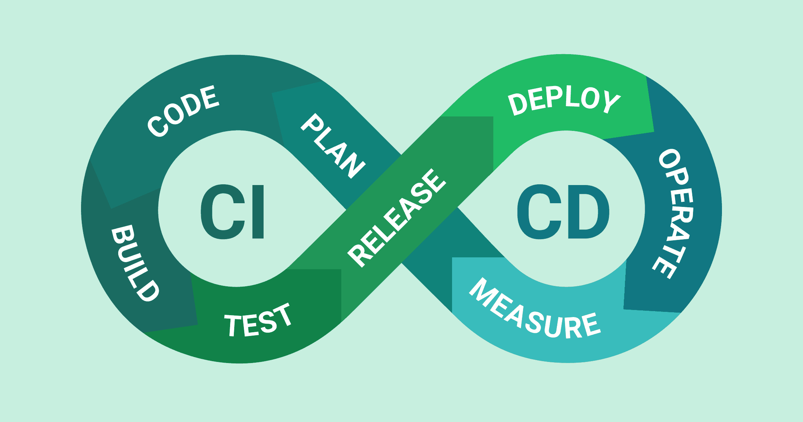

# Généralités
Vous savez développer, tester, déployer, indépendamment et manuellement.
Lorsqu'on travaille sur un projet conséquent, la rigueur sur chaque étape est la clé d'un travail propre et d'une avancée régulière. Qu'on soit seul ou en équipe, mettre en place des outils pour nous aider à travailler efficacement devient rapidement une nécessité. Le gain de temps, la gestion des erreurs et bugs, la stabilité du code au fur et à mesure qu'on avance, le développement au fil de l'eau de nouvelles fonctionnalités, ... Tout cela justifie grandement l'apprentissage de stratégies et d'outils de CI/CD. 

## Continuous integration (CI)
La CI, l'intégration continue, c'est automatiser des processus d'acceptation du code, pour faire en sorte que chaque nouveau bout de code écrit réponde aux standards du projet, sans casser le code existant.

## Continuous Deployment (CD)
La CD, le déploiement continu, c'est automatiser les processus de mise en ligne, afin d'avoir un site en production qui prend en compte toutes les modifications validées précédemment par la CI, le plus vite possible.

Ces deux principes permettent de mettre en place plusieurs choses : 
- Code testé tout le temps
- Tests qui guident le développement (TDD - test driven development)
- Déploiement dès que possible de la dernière version stable
- Amélioration continue suite aux remontées de bugs
- Mise à jour régulière de l'application
- stabilité du code sur la durée
- Concentration des développeurs sur le code, et pas sur la recherche de bugs, de failles, ...
- ...

## Etapes possibles

Dans ce cours nous verrons comment :

1. automatiser les tests
2. pousser le code validé sur une nouvelle branche
3. pousser le code en production
4. ajouter des contrôles de qualité du code