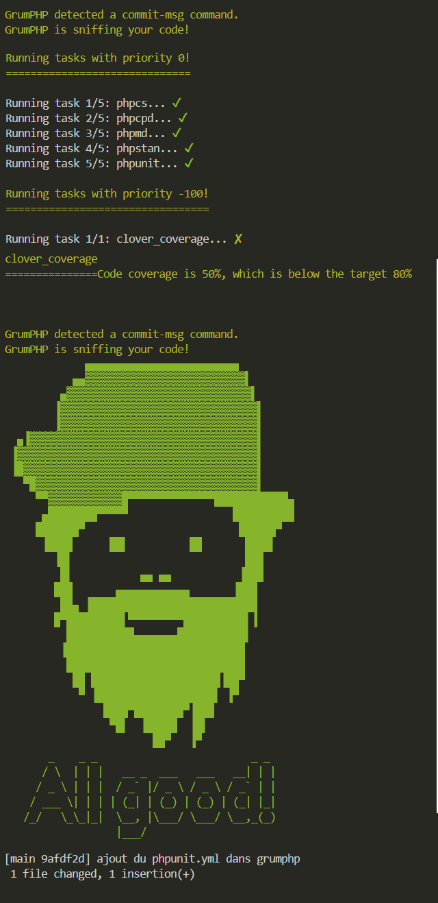

# GrumPHP
C'est un outil qui permet de déclencher toute une série de processus (qu'on choisit nous) lors d'un évènement très précis : **le commit**.

À chaque fois que vous ferez un `git commit`, automatiquement grumPHP s'exécutera. 



Comme on peut le voir dans cette capture d'écran, au moment où j'ai lancé un commit, grumPHP c'est exécuté. Il m'a effectué une série de tests, et si tout est bon, mon commit est accepté. Je peux alors pousser mon code en ligne. 

Mais parfois il arrive que Grumphp ne soit pas content... Et que moi, j'ai à tout prix besoin de pousser mon code quand même (d'autres devs ont besoin de mon code, même s'il n'est pas parfait, je fais une sauvegarde le soir avant mes vacances, ...) dans ce cas, je peux forcer l'acceptation du commit malgré tout, en ajoutant le drapeau `-n`. Mais du coup, comme les `required` en html, si je peux faire sauter aussi facilement le contrôle, il faut que mon dépôt soit capable de gérer lui-même les tests et autre. On verra ça dans le [cours 4](<04 cours 4 - gitlab-ci.yml.md>).

## Installation
Franchement, c'est pas compliqué :  
[📜 Documentation de GrumPHP](https://github.com/phpro/grumphp)

```bash
composer require --dev phpro/grumphp
```

On peut déjà exécuter grumPHP avec `./vendor/bin/grumphp run`.
Je vous laisse faire un petit raccourci de commande composer, comme on l'a vu dans le [cours 2](<02. cours 2 - Automatiser les tests.md>).

Maintenant, nous on veut que grumPHP exécute pour nous d'autres trucs, comme :
- **phpunit**, mais aussi, pourquoi pas,
- **code sniffer**, pour s'assurer que notre code répond aux standards d'écriture (indentation, retours à la ligne, ...),
- **phpcpd** pour vérifier si on pourrait pas factoriser notre code, qu'on retrouve [ici](https://gitlab.irstea.fr/pole-is/tools/phpcpd-shim),
- **security-checker** pour s'assurer que tous nos packages sont avec des versions sûres,
- **phpstan** qui vérifie si on répond à une hygiène de code (typage des paramètres attendus, des retours des fonctions, ...),
- et dans d'autres dont vous retrouverez la liste dans la documentation de grumPHP.

toutes les installations se font avec composer.

Pour pouvoir paramétrer l'outil à exécuter chacun de ces contrôles, il faut créer un fichier `grumphp.yml`. Dedans, on pourra indiquer les choses ainsi : 

```yaml
grumphp:
  tasks:
    phpcs:
      standard: psr12
    
    phpunit: ~

    [...]
```


## Activité 2 
Pour commencer à travailler, vous pouvez télécharger [cette archive](exemples/tests-et-ci-cd-1.0.0.zip), et la décompresser dans votre dossier.

Je vous laisse vous amuser à personnaliser le fichier `grumphp.yml` pour qu'il vous permette de faire tourner vos différents contrôles. Amusez-vous à jouer avec les paramètres de chaque élément, pour comprendre l'utilité de tout ça. 

Pour l'exemple, vous trouverez mon `grumphp.yml` complet [ici](exemples/grumphp.yml). Évidemment, vous ne le pomperez pas, parce que vous avez compris qu'on comprend rien avec `CTRL+C & CTRL+V`. Enfin, j'espère.

Potentiellement, pour certains packages, vous pourriez avoir besoin de fichiers `.xml`, pour personnaliser plus en avant les contrôles. Par exemple, moi j'aime pas les indentations à 4 espaces. Je préfère à 2. Mais PSR12 impose le 4 espaces quand même... Et bien je peux personnaliser PSR12, pour que dans mon projet, dans mon entreprise, on travaille avec 2 espaces. On pourra d'ailleurs compléter ça avec un `.editorconfig`, afin de s'assurer que tous les devs ont les mêmes paramètres dans le VSCode. 

Bravo, vous savez maintenant contrôler vos commits, et faire subir à votre code toute une série de tests divers et variés, permettant de vous assurer d'une plus grande propreté et qualité du code. Maintenant, on peut passer au [cours N°4](<04 cours 4 - gitlab-ci.yml.md>).